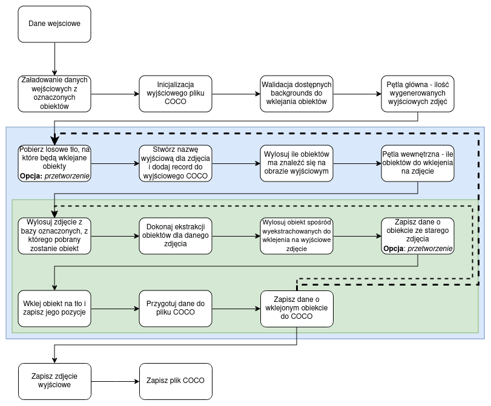

# Synthetic data generator - automated pipeline
Synthetic data generator used to create synthetic photos by taking data from a source photo based on the database stored in COCO and pasting it into the output photo.
## Preparing the environment
```bash
python3 -m venv venv
source .venv/bin/activate
pip3 install -r requirements.txt
```
## Program start
```bash
python3 main.py --coco /path/to/coco/file/annotations.json \
--library /path/to/library/images \
--input /path/to/backgrounds/directory \
--output /path/to/output/directory \
--number 5
```
## Pipeline diagram

#### Agnieszka Piórkowska, Miłosz Gajewski
##### Politechnika Poznańska 2023