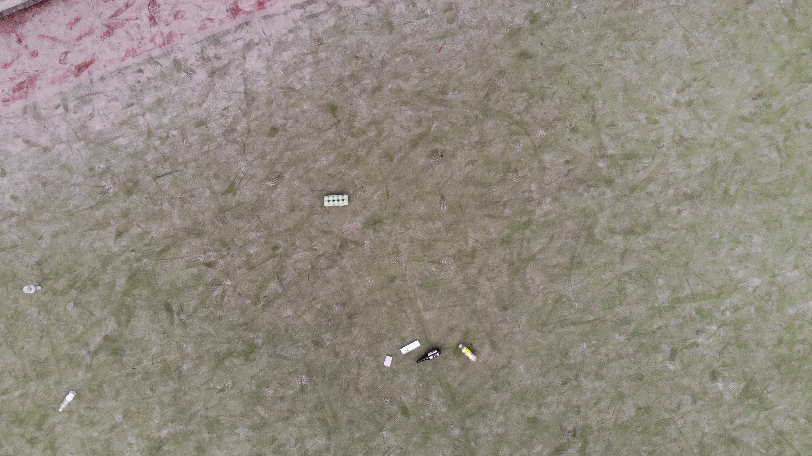
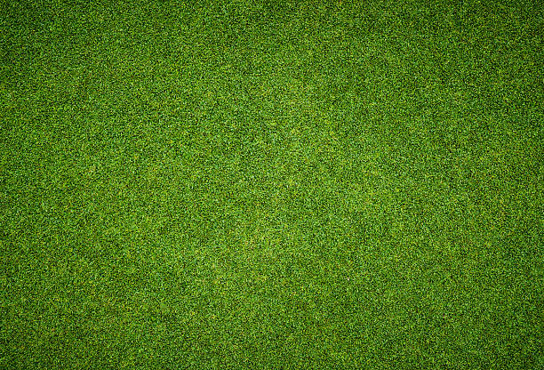

# Synthetic data generator
Synthetic data generator used to create synthetic photos by taking data from a source photo based on the database stored in COCO and pasting it into the output photo.
## Preparing the environment
```bash
python3 -m venv venv
source .venv/bin/activate
pip3 install -r requirements.txt
```
## Program start
```bash
python3 main.py --coco /path/to/coco/file/annotations.json \
--library /path/to/library/images \
--input photo_name.jpg \
--output /path/to/output/photo/fil_1.png \
--position_x 10 \
--position_y 20 \
--scale 0.5 \
--object 1
```
## Example output
**Used input:**
```bash
python3 main.py \
--coco annotations.json \
--library images \
--input batch_05_img_1780.jpg \
--output docs/output_image.jpg
```
**Input image:** \
 \
**Extracted object:** \
 \
**Background image:** \
 \
**Result:** \

#### Agnieszka Piórkowska, Miłosz Gajewski
##### Politechnika Poznańska 2023